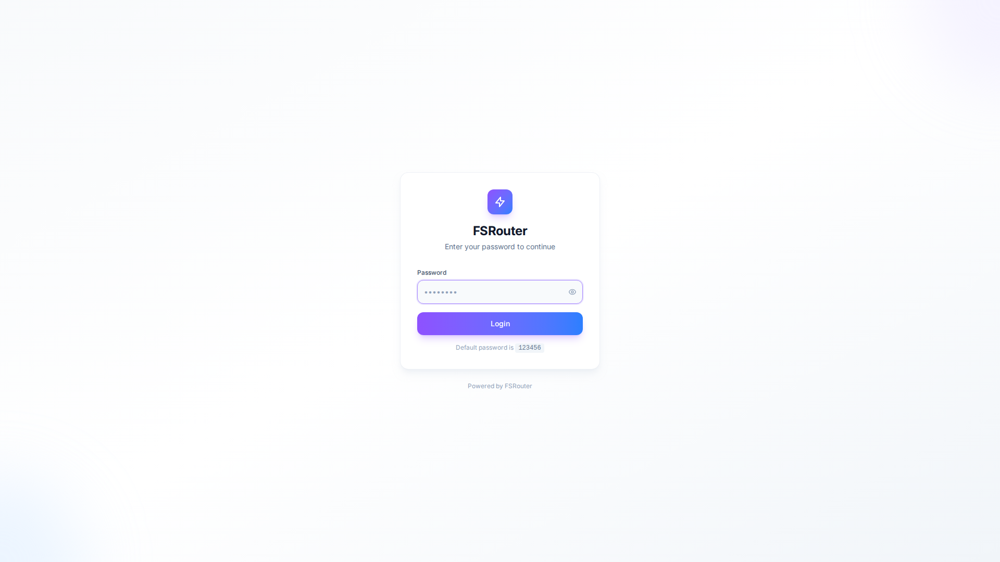
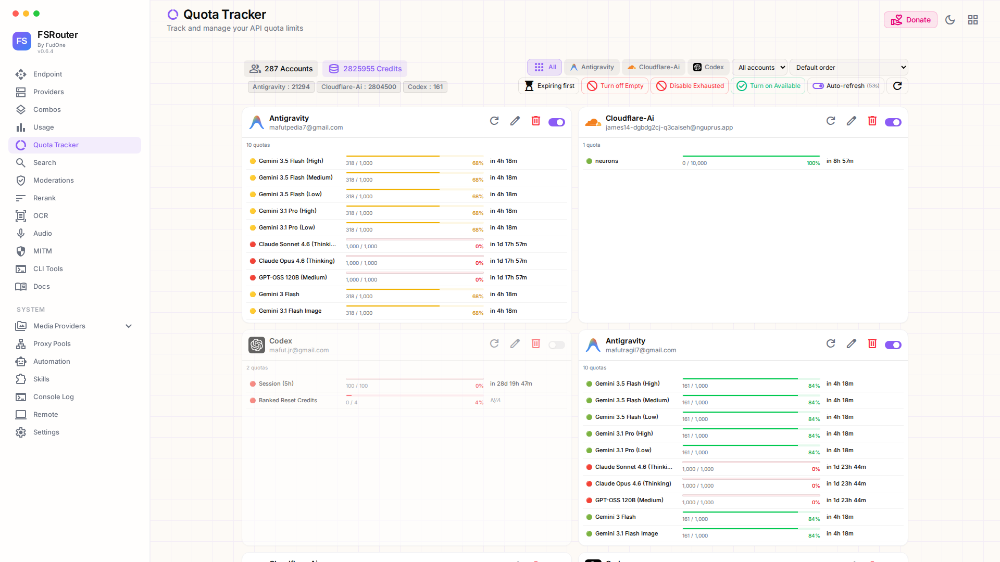

# FSRouter

> A self-hosted AI gateway — one endpoint, many providers, auto-fallback.

FSRouter is a decoupled rewrite of 9Router with a clean separation between a dedicated **Express backend** and a **Vite + React frontend**. It exposes an OpenAI-compatible REST API that proxies requests across dozens of AI providers with automatic load balancing, fallback, and key rotation.

---

## Screenshots

| Login Page | Quota Tracker |
|:---:|:---:|
|  |  |

---

## Features

- **OpenAI-compatible API** — works with any client that supports `/v1/chat/completions`, `/v1/images/generations`, `/v1/audio/speech`, `/v1/embeddings`, etc.
- **Multi-provider routing** — Cloudflare Workers AI, OpenAI, Anthropic, Gemini, Groq, and many more
- **Cloudflare Workers AI Automation** — automates account registration and API key extraction with Playwright + 2Captcha + FSMail temp mail
- **Dashboard UI** — manage providers, connections, proxy pools, CLI tools, and automation from a modern dark-mode interface
- **OIDC / Password authentication** — single sign-on or local credentials
- **Agent Skills** — ready-to-use SKILL.md files for Claude, Gemini, Codex, and other AI coding agents
- **SQLite backend** — zero-dependency local database, no external services required

---

## Architecture

```
FSRouter/
├── backend/          # Express server (port 3001)
│   └── src/
│       ├── routes/   # Auto-routed endpoints (/v1, /api, /auth, ...)
│       ├── db/       # SQLite via better-sqlite3
│       └── automation/ # Playwright automation scripts
├── frontend/         # Vite + React SPA (port 5177)
│   └── src/
│       ├── pages/    # Dashboard pages
│       └── shared/   # Components, hooks, constants
└── skills/           # Agent SKILL.md files
```

---

## Quick Start

### Requirements

- Node.js 20+
- Python 3.10+ (for automation features)
- Chromium (for Playwright automation)

### Install

```bash
git clone https://github.com/nexusrouters/fsrouter.git
cd FSRouter
npm install
```

### Development

```bash
npm run dev          # Start both backend + frontend concurrently
npm run backend      # Backend only (port 3001)
npm run frontend     # Frontend only (port 5177)
```

### Environment Variables

Copy and configure the backend environment:

```bash
cp backend/.env.template backend/.env
```

Key variables:

| Variable | Description |
|---|---|
| `PORT` | Backend server port (default: `3001`) |
| `REQUIRE_LOGIN` | Enable authentication (`true`/`false`) |
| `JWT_SECRET` | Secret for JWT signing |
| `ADMIN_PASSWORD` | Dashboard admin password |

---

## Production Deployment

### 1. Build Frontend

```bash
cd frontend && npm run build
```

### 2. Start Backend

```bash
cd backend && npm start
```

### 3. Nginx Reverse Proxy

Use the included `nginx.conf` to proxy `/api` and `/v1` to the backend while serving the built frontend statically. See `docs/deployment-linux.md` for a full Linux deployment guide.

---

## Cloudflare Workers AI Automation

The automation module automatically registers Cloudflare Workers AI accounts:

1. Configure **FSMail** temp mail credentials in Dashboard → Automation → Settings
2. Add a **2Captcha** API key for Turnstile solving
3. Add email accounts in the Automation tab and click **Run**
4. API keys are extracted and added to FSRouter automatically

---

## Agent Skills

Skills are SKILL.md files for AI coding agents. Paste the entry skill URL into your AI:

```
Read this skill and use it:
https://raw.githubusercontent.com/nexusrouters/fsrouter/refs/heads/main/skills/fsrouter/SKILL.md
```

Browse all skills in the Dashboard → Skills page or in the [`skills/`](./skills/) directory.

---

## API Reference

| Endpoint | Description |
|---|---|
| `GET /api/health` | Health check |
| `GET /v1/models` | List available chat/LLM models |
| `POST /v1/chat/completions` | Chat completions (streaming supported) |
| `POST /v1/images/generations` | Image generation |
| `POST /v1/audio/speech` | Text-to-speech |
| `POST /v1/audio/transcriptions` | Speech-to-text |
| `POST /v1/embeddings` | Text embeddings |
| `GET /v1/search` | Web search |

---

## License

MIT — see [LICENSE](./LICENSE)

---

## Acknowledgements

> 🙏 **Thanks to [FSRouter](https://github.com/decolua/fsrouter)** — this project is a fork and architectural rewrite of the original FSRouter monolith. The core routing logic, provider integrations, and many features were inspired by and built upon the excellent work of the FSRouter project.
